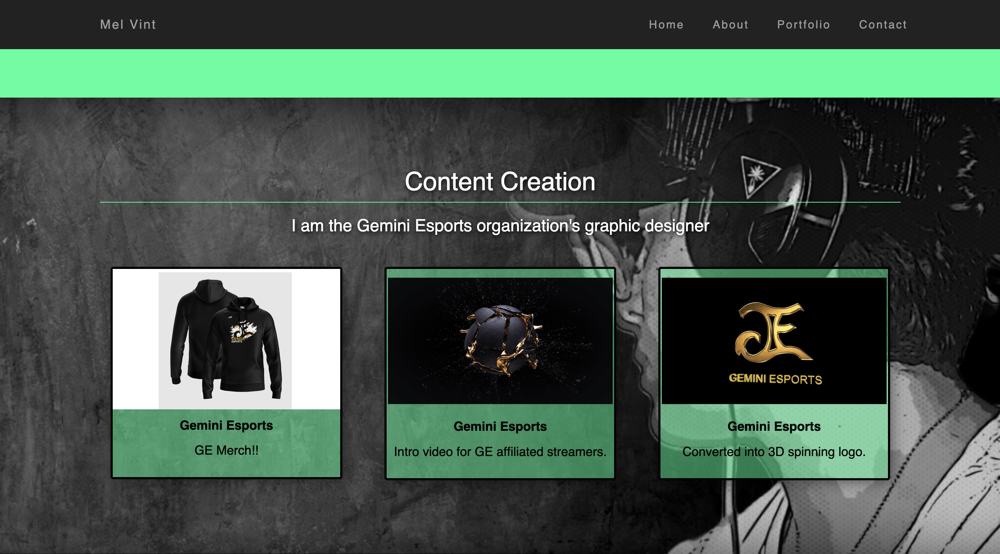

(PSA Site is published, still working on it.)

# PortfolioVint

Decided to change up my portfolio and upgraded it. The majority of the code is CSS.  

## Table of Contents

  - [Table of Contents](#table-of-contents)
  - [Usage](#usage)
  - [Features](#features)
  - [License](#license)
  - [Contributing](#contributing)
  - [Screenshots](#screenshots)
  - [Questions](#questions)

## Usage
1. Go to Live site Listed below.
2. Scan the site for each topic (About Me/ Skills/ and Contact info.)
3. To reach contact info towards the bottom of site.
4. Have fun!

The Live link of the application is available at:  [Live Site Here!](https://mvint2647.github.io/Integration/)
## Features
* Responsive Smooth Scroll
* Active Features
* Email Opportunity
* Browse Through Work.

## License
This project uses the MIT license
## Contributing
Pull requests are not welcome
## Screenshots
**Home Page**

## Questions
Checkout my GitHub [profile](https://github.com/mvint2647)

Please feel free to email at: <Melissavinny1133@gmail.com>
